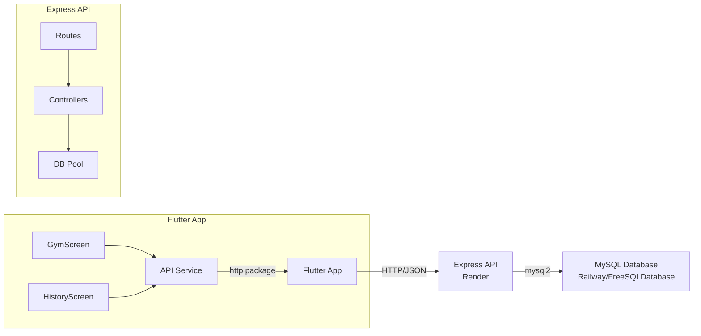

# Design Document: Gym Tracker Backend

## Overview

This design describes a Node.js Express REST API backend with a MySQL database for the Flutter Gym Tracker app. The system follows a simple three-tier architecture: Flutter client → Express API → MySQL database. The backend provides full CRUD operations for workout sessions, exercises, and sets, deployed to a public URL on Render's free tier.

The Flutter app will be updated with an API service layer, updated data models with JSON serialization, and a new History Screen to meet the CSCI410 two-screen requirement.

### Design Decisions

1. **Raw SQL over ORM**: Using `mysql2` with raw queries keeps the project simple and avoids ORM learning curve for a student project.
2. **Flat route structure**: Routes are nested logically (`/api/sessions/:id/exercises`) to express resource ownership while keeping the Express router straightforward.
3. **Separate backend directory**: The Node.js project lives in a `backend/` folder at the repository root, keeping it co-located with the Flutter project for easy development.
4. **No authentication**: The project requirements don't specify auth, so the API is open. This simplifies the implementation for the course deadline.

## Architecture



### Backend Project Structure

```
backend/
├── package.json
├── .env                  # DB credentials (gitignored)
├── .env.example          # Template for env vars
├── index.js              # Entry point: creates app, starts server
├── db.js                 # MySQL connection pool setup
├── routes/
│   ├── sessions.js       # Session CRUD routes
│   ├── exercises.js      # Exercise CRUD routes
│   └── sets.js           # Workout set CRUD routes
└── middleware/
    └── errorHandler.js   # Global error handling middleware
```

### Flutter App Structure Changes

```
lib/
├── main.dart             # Entry point (unchanged)
├── gym_app.dart          # MaterialApp with route definitions (updated)
├── gym_screen.dart       # Main workout screen (updated to use API)
├── history_screen.dart   # NEW: Workout history screen
├── models.dart           # Updated models with id, JSON serialization
├── widgets.dart          # UI widgets (unchanged)
└── api_service.dart      # NEW: HTTP client for backend communication
```

## Components and Interfaces

### Backend Components

#### 1. Entry Point (`index.js`)

Initializes Express app, applies middleware (CORS, JSON parsing), mounts route handlers, and starts the HTTP server.

```javascript
// Responsibilities:
// - Configure Express middleware (cors, express.json)
// - Mount route modules
// - Start server on PORT from env
// - Global 404 handler for undefined routes
```

#### 2. Database Pool (`db.js`)

Creates and exports a mysql2 connection pool using environment variables.

```javascript
// Exports: pool (mysql2 promise pool)
// Config from env: DB_HOST, DB_USER, DB_PASSWORD, DB_NAME, DB_PORT
```

#### 3. Route Modules

**Sessions (`routes/sessions.js`)**
| Method | Path | Description |
|--------|------|-------------|
| POST | `/api/sessions` | Create new session |
| GET | `/api/sessions` | List all sessions (desc by date) |
| GET | `/api/sessions/:id` | Get session with exercises and sets |
| PUT | `/api/sessions/:id` | Update session (set ended_at) |
| DELETE | `/api/sessions/:id` | Delete session (cascade) |

**Exercises (`routes/exercises.js`)**
| Method | Path | Description |
|--------|------|-------------|
| POST | `/api/sessions/:sessionId/exercises` | Create exercise in session |
| GET | `/api/sessions/:sessionId/exercises` | List exercises for session |
| PUT | `/api/exercises/:id` | Update exercise name |
| DELETE | `/api/exercises/:id` | Delete exercise (cascade) |

**Sets (`routes/sets.js`)**
| Method | Path | Description |
|--------|------|-------------|
| POST | `/api/exercises/:exerciseId/sets` | Create set in exercise |
| GET | `/api/exercises/:exerciseId/sets` | List sets for exercise |
| PUT | `/api/sets/:id` | Update set reps/weight |
| DELETE | `/api/sets/:id` | Delete set |

#### 4. Error Handler Middleware (`middleware/errorHandler.js`)

Catches unhandled errors, logs them, and returns a consistent JSON error response.

### Flutter Components

#### 5. API Service (`api_service.dart`)

Singleton class that encapsulates all HTTP communication with the backend.

```dart
class ApiService {
  static const String baseUrl = 'https://<app-name>.onrender.com/api';
  
  // Sessions
  Future<Session> createSession();
  Future<List<Session>> getSessions();
  Future<Session> getSession(int id);
  Future<Session> endSession(int id, DateTime endedAt);
  Future<void> deleteSession(int id);
  
  // Exercises
  Future<Exercise> createExercise(int sessionId, String name);
  Future<List<Exercise>> getExercises(int sessionId);
  Future<Exercise> updateExercise(int id, String name);
  Future<void> deleteExercise(int id);
  
  // Sets
  Future<WorkoutSet> createSet(int exerciseId, int reps, double weight);
  Future<List<WorkoutSet>> getSets(int exerciseId);
  Future<WorkoutSet> updateSet(int id, int reps, double weight);
  Future<void> deleteSet(int id);
}
```

#### 6. History Screen (`history_screen.dart`)

A StatefulWidget that displays past workout sessions in a scrollable list. Tapping a session shows its exercises and sets in a detail view.

### API Request/Response Formats

**Create Session**
```
POST /api/sessions
Response 201:
{ "id": 1, "started_at": "2025-01-15T10:30:00.000Z", "ended_at": null }
```

**List Sessions**
```
GET /api/sessions
Response 200:
[{ "id": 1, "started_at": "...", "ended_at": "...", "exercise_count": 3 }]
```

**Get Session Detail**
```
GET /api/sessions/1
Response 200:
{
  "id": 1, "started_at": "...", "ended_at": "...",
  "exercises": [
    { "id": 1, "name": "Bench Press", "sets": [
      { "id": 1, "reps": 10, "weight": 60.0 }
    ]}
  ]
}
```

**Create Exercise**
```
POST /api/sessions/1/exercises
Body: { "name": "Bench Press" }
Response 201: { "id": 1, "session_id": 1, "name": "Bench Press" }
```

**Create Set**
```
POST /api/exercises/1/sets
Body: { "reps": 10, "weight": 60.0 }
Response 201: { "id": 1, "exercise_id": 1, "reps": 10, "weight": 60.0 }
```

**Error Response Format**
```
{ "error": "Session not found" }
```

## Data Models

### Database Schema (MySQL)

```sql
CREATE TABLE sessions (
  id INT AUTO_INCREMENT PRIMARY KEY,
  started_at TIMESTAMP DEFAULT CURRENT_TIMESTAMP,
  ended_at TIMESTAMP NULL
);

CREATE TABLE exercises (
  id INT AUTO_INCREMENT PRIMARY KEY,
  session_id INT NOT NULL,
  name VARCHAR(255) NOT NULL,
  FOREIGN KEY (session_id) REFERENCES sessions(id) ON DELETE CASCADE
);

CREATE TABLE workout_sets (
  id INT AUTO_INCREMENT PRIMARY KEY,
  exercise_id INT NOT NULL,
  reps INT NOT NULL,
  weight DECIMAL(6,2) NOT NULL,
  FOREIGN KEY (exercise_id) REFERENCES exercises(id) ON DELETE CASCADE
);
```

### Flutter Data Models

```dart
class Session {
  final int? id;
  final DateTime startedAt;
  final DateTime? endedAt;
  List<Exercise> exercises;

  Session({this.id, required this.startedAt, this.endedAt, List<Exercise>? exercises})
      : exercises = exercises ?? [];

  factory Session.fromJson(Map<String, dynamic> json) => Session(
    id: json['id'],
    startedAt: DateTime.parse(json['started_at']),
    endedAt: json['ended_at'] != null ? DateTime.parse(json['ended_at']) : null,
    exercises: json['exercises'] != null
        ? (json['exercises'] as List).map((e) => Exercise.fromJson(e)).toList()
        : [],
  );

  Map<String, dynamic> toJson() => {
    'id': id,
    'started_at': startedAt.toIso8601String(),
    'ended_at': endedAt?.toIso8601String(),
  };
}

class Exercise {
  final int? id;
  final int? sessionId;
  String name;
  List<WorkoutSet> sets;

  Exercise({this.id, this.sessionId, required this.name, List<WorkoutSet>? sets})
      : sets = sets ?? [];

  factory Exercise.fromJson(Map<String, dynamic> json) => Exercise(
    id: json['id'],
    sessionId: json['session_id'],
    name: json['name'],
    sets: json['sets'] != null
        ? (json['sets'] as List).map((s) => WorkoutSet.fromJson(s)).toList()
        : [],
  );

  Map<String, dynamic> toJson() => {
    'id': id,
    'session_id': sessionId,
    'name': name,
  };
}

class WorkoutSet {
  final int? id;
  final int? exerciseId;
  int reps;
  double weight;

  WorkoutSet({this.id, this.exerciseId, required this.reps, required this.weight});

  factory WorkoutSet.fromJson(Map<String, dynamic> json) => WorkoutSet(
    id: json['id'],
    exerciseId: json['exercise_id'],
    reps: json['reps'],
    weight: (json['weight'] as num).toDouble(),
  );

  Map<String, dynamic> toJson() => {
    'id': id,
    'exercise_id': exerciseId,
    'reps': reps,
    'weight': weight,
  };
}
```

## Correctness Properties

*A property is a characteristic or behavior that should hold true across all valid executions of a system — essentially, a formal statement about what the system should do. Properties serve as the bridge between human-readable specifications and machine-verifiable correctness guarantees.*

### Property 1: Model Serialization Round-Trip

*For any* valid Session, Exercise, or WorkoutSet object with populated fields, serializing to JSON via `toJson()` and then deserializing back via `fromJson()` SHALL produce an object with equivalent field values.

**Validates: Requirements 8.5**

### Property 2: All API Responses Are Valid JSON

*For any* HTTP request sent to the backend (whether to a valid or invalid route), the response body SHALL be parseable as valid JSON and the Content-Type header SHALL be `application/json`.

**Validates: Requirements 1.4**

### Property 3: Invalid Routes Return 404

*For any* HTTP request to a path that does not match a defined API route, the backend SHALL return a 404 status code with a JSON error message.

**Validates: Requirements 1.5**

### Property 4: Create Operations Return Correct Resource

*For any* valid create request (POST to sessions, exercises, or sets with valid required fields), the API SHALL return a 201 status code with a JSON body containing the created resource including a server-assigned `id` and all submitted field values preserved.

**Validates: Requirements 3.1, 4.1, 5.1**

### Property 5: Sessions List Is Sorted Descending

*For any* set of sessions in the database, a GET request to `/api/sessions` SHALL return them ordered by `started_at` descending (most recent first).

**Validates: Requirements 3.2**

### Property 6: GET Returns Complete Nested Associations

*For any* session with exercises and sets, a GET request to `/api/sessions/:id` SHALL return the session object containing all its exercises, and each exercise SHALL contain all its workout sets.

**Validates: Requirements 3.3, 4.2**

### Property 7: Update Operations Persist Changes

*For any* existing resource (session, exercise, or set) and any valid update payload, a PUT request followed by a GET request for the same resource SHALL return the updated field values.

**Validates: Requirements 3.4, 4.3, 5.3**

### Property 8: Delete Operations Cascade to Children

*For any* session with exercises and sets, deleting the session SHALL also remove all its exercises and their sets. Similarly, deleting an exercise SHALL remove all its sets. A subsequent GET for any deleted resource SHALL return 404.

**Validates: Requirements 3.5, 4.4, 5.4**

### Property 9: Non-Existent Resource References Return 404

*For any* ID that does not correspond to an existing resource, GET, PUT, or DELETE requests targeting that ID SHALL return a 404 status code with a JSON error message.

**Validates: Requirements 3.6, 4.5, 5.5**

### Property 10: Missing Required Fields Return 400

*For any* POST request to create an exercise missing the `name` field, or a POST request to create a workout set missing `reps` or `weight`, the API SHALL return a 400 status code with a validation error message.

**Validates: Requirements 4.6, 5.6**

## Error Handling

### Backend Error Handling Strategy

| Layer | Error Type | Handling |
|-------|-----------|----------|
| Route | Invalid route | 404 JSON response from catch-all handler |
| Controller | Resource not found | 404 JSON response |
| Controller | Validation failure | 400 JSON response with field-specific message |
| Controller | Database error | 500 JSON response with generic message |
| Middleware | Unhandled exception | Global error handler returns 500 |

**Error Response Format:**
```json
{ "error": "Human-readable error message" }
```

**Implementation approach:**
- Each route handler wraps database calls in try/catch
- Validation checks run before database operations
- The global error handler middleware catches anything that slips through
- Database connection errors are logged server-side but return a generic 500 to the client

### Flutter Error Handling Strategy

| Scenario | Handling |
|----------|----------|
| Network unreachable | Show SnackBar with "Cannot connect to server" message |
| API returns 4xx/5xx | Parse error message from response, show in SnackBar |
| JSON parse failure | Show generic "Something went wrong" message |
| Timeout (>10s) | Show "Request timed out" message |

**Implementation approach:**
- `ApiService` methods throw custom exceptions on non-2xx responses
- UI layer catches exceptions and displays appropriate SnackBar messages
- All HTTP requests use a 10-second timeout
- The app remains functional for viewing cached/in-memory data even when offline (graceful degradation)

## Testing Strategy

### Backend Testing

**Framework:** Jest (standard for Node.js projects)

**Unit Tests (example-based):**
- Route handler logic with mocked database pool
- Validation functions for request bodies
- Error handler middleware behavior
- Specific edge cases: empty strings, negative numbers, very long names

**Integration Tests:**
- Full request/response cycle against a test database
- Foreign key constraint enforcement (2.4, 2.5)
- Cascade delete behavior verification

**Property-Based Tests (using fast-check):**
- Minimum 100 iterations per property
- Test the pure logic layer (validation, response formatting, sorting)
- Use mocked database for CRUD round-trip properties

### Flutter Testing

**Framework:** flutter_test + mockito for mocking

**Unit Tests:**
- Model `fromJson`/`toJson` with sample data
- `ApiService` methods with mocked HTTP client
- Verify correct endpoints, methods, and body formatting

**Property-Based Tests (using dart_check or custom generators with flutter_test):**
- Model serialization round-trip (Property 1)
- Minimum 100 iterations

**Widget Tests:**
- History Screen renders session list correctly
- Empty state displays appropriate message
- Navigation between screens works

### Property Test Configuration

- Library: `fast-check` (Node.js backend), `dart_check` or custom generators (Flutter)
- Iterations: minimum 100 per property
- Tag format: `Feature: gym-tracker-backend, Property {N}: {title}`

### Test Commands

```bash
# Backend
cd backend && npm test

# Flutter
flutter test
```

## Deployment Configuration

### Render Deployment (Backend)

**Build Command:** `npm install`
**Start Command:** `node index.js`

**Environment Variables on Render:**
| Variable | Description |
|----------|-------------|
| `PORT` | Set by Render automatically |
| `DB_HOST` | MySQL host from Railway/FreeSQLDatabase |
| `DB_PORT` | MySQL port (usually 3306) |
| `DB_USER` | Database username |
| `DB_PASSWORD` | Database password |
| `DB_NAME` | Database name |

### `package.json` (Backend)

```json
{
  "name": "gym-tracker-backend",
  "version": "1.0.0",
  "main": "index.js",
  "scripts": {
    "start": "node index.js",
    "test": "jest"
  },
  "dependencies": {
    "cors": "^2.8.5",
    "dotenv": "^16.4.7",
    "express": "^4.21.2",
    "mysql2": "^3.12.0"
  },
  "devDependencies": {
    "jest": "^29.7.0",
    "fast-check": "^3.23.2"
  }
}
```

### Flutter Dependency Addition

Add to `pubspec.yaml`:
```yaml
dependencies:
  http: ^1.2.2
```

### Database Initialization Script

Run once on the hosted MySQL instance to create tables:

```sql
CREATE TABLE IF NOT EXISTS sessions (
  id INT AUTO_INCREMENT PRIMARY KEY,
  started_at TIMESTAMP DEFAULT CURRENT_TIMESTAMP,
  ended_at TIMESTAMP NULL
);

CREATE TABLE IF NOT EXISTS exercises (
  id INT AUTO_INCREMENT PRIMARY KEY,
  session_id INT NOT NULL,
  name VARCHAR(255) NOT NULL,
  FOREIGN KEY (session_id) REFERENCES sessions(id) ON DELETE CASCADE
);

CREATE TABLE IF NOT EXISTS workout_sets (
  id INT AUTO_INCREMENT PRIMARY KEY,
  exercise_id INT NOT NULL,
  reps INT NOT NULL,
  weight DECIMAL(6,2) NOT NULL,
  FOREIGN KEY (exercise_id) REFERENCES exercises(id) ON DELETE CASCADE
);
```
